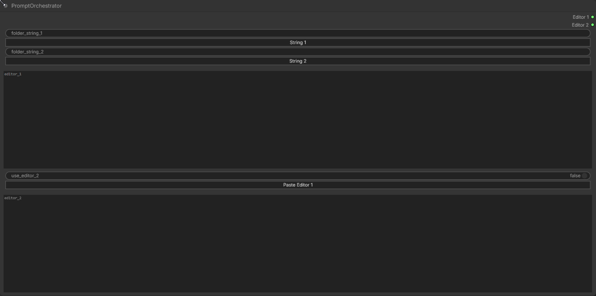
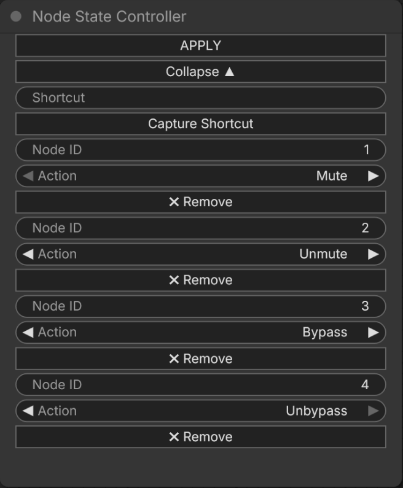

# ComfyUI-Orchestration-Toolkit

A custom node pack for ComfyUI that improves prompt handling and workflow control.

## Included Nodes

### PromptOrchestrator

A prompt management node designed for efficient text prompt handling.

It provides a clear interface for working with prompt lists stored as `.txt` files and separates the workflow into two branches:

- **Multi-Prompt Testing Branch**  
  Loads curated prompt lists from the `CuratedPrompts` folder for testing and comparing multiple prompts.

- **Prompt Generation Branch**  
  Loads generated prompt lists from the `GeneratedPrompts` folder for prompt creation, refinement, or reuse.

The node loads the latest `.txt` file from each folder, provides two editable prompt fields, allows pasting the testing editor content into the generation editor, and lets you choose which branch is sent to the output.

This node is part of a workflow module built for structured multi-prompt testing and prompt generation inside ComfyUI.



### Node State Controller

A workflow control node that allows you to enter the ID of any node and define what should happen to it when pressing the apply button.  
You can mute, unmute, bypass, or unbypass any number of nodes with a single click — without adding additional connections to the canvas.



## Installation

Install directly via the ComfyUI Manager.

Alternatively, clone the repository into your `ComfyUI/custom_nodes/` directory:

```bash
git clone https://github.com/flows-and-frames/ComfyUI-Orchestration-Toolkit.git
